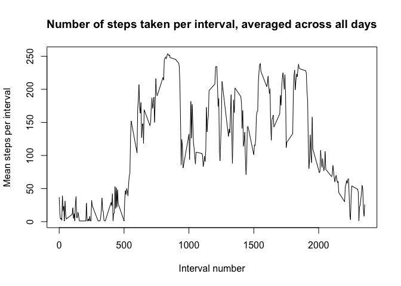
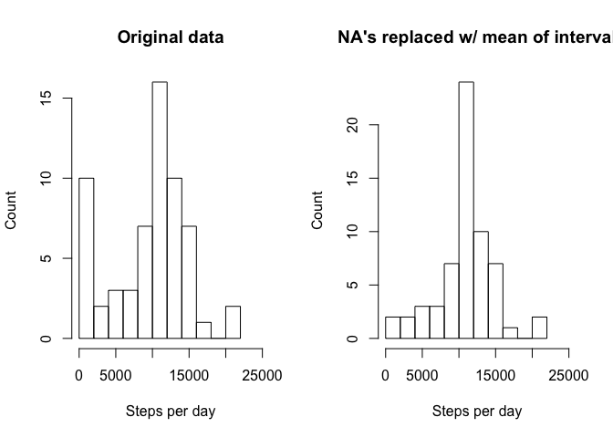

# Reproducible Research: Peer Assessment 1


## Loading and preprocessing the data
1. Load the data (i.e. read.csv())
2. Process/transform the data (if necessary) into a format suitable for your analysis

* Download, unzip, read in the data.

```r
rm(list = ls())
setwd("~/desk/classes/DataScience_Coursera/5-ReproducibleResearch/RepData_PeerAssessment1/")
url <- "https://d396qusza40orc.cloudfront.net/repdata%2Fdata%2Factivity.zip"

if (!file.exists("activity.zip")) {
    download.file(url, dest = "activity.zip", method = "curl")
}
unzip("activity.zip")

stepData <- read.csv("activity.csv")
```


## What is mean total number of steps taken per day?
1. Calculate the total number of steps taken per day
2. If you do not understand the difference between a histogram and a barplot, research the difference between them. Make a histogram of the total number of steps taken each day
3. Calculate and report the mean and median of the total number of steps taken per day

* Use tapply to sum steps per day, then hist to plot histogram.

```r
stepsPerDay <- with( stepData, tapply(steps, date, sum, na.rm = T) )

hist(stepsPerDay, 
    breaks = 10, 
    main = "Distribution of steps taken per day", 
    xlab = "Steps per day", 
    ylab = "Count", 
    xlim = c(0, 25000))
```

 

```r
mean(stepsPerDay)
```

```
## [1] 9354.23
```

```r
median(stepsPerDay)
```

```
## [1] 10395
```


## What is the average daily activity pattern?
1. Make a time series plot (i.e. type = "l") of the 5-minute interval (x-axis) and the average number of steps taken, averaged across all days (y-axis)
2. Which 5-minute interval, on average across all the days in the dataset, contains the maximum number of steps?

* Create data factor to store mean steps per interval.  Set names of elements in the factor to be the interval number.  Use plot to create plot and which.max to find the max interval.

```r
intervals <- unique(stepData$interval)
meanStepsPerInterval <- factor( with(stepData, tapply(steps, interval, mean, na.rm = T) ) )
names(meanStepsPerInterval) <- intervals

plot(intervals, 
    meanStepsPerInterval, 
    type = "l", 
    ylab = "Mean steps per interval", 
    xlab = "Interval number", 
    main = "Number of steps taken per interval, averaged across all days")
```

 

```r
intervals[which.max(meanStepsPerInterval)]
```

```
## [1] 835
```


## Imputing missing values
1. Calculate and report the total number of missing values in the dataset (i.e. the total number of rows with NAs)
2. Devise a strategy for filling in all of the missing values in the dataset. The strategy does not need to be sophisticated. For example, you could use the mean/median for that day, or the mean for that 5-minute interval, etc.
3. Create a new dataset that is equal to the original dataset but with the missing data filled in.
4.  Make a histogram of the total number of steps taken each day and Calculate and report the mean and median total number of steps taken per day. Do these values differ from the estimates from the first part of the assignment? What is the impact of imputing missing data on the estimates of the total daily number of steps?

* For each missing value, for that interval, replace it with the mean value for the interval over all days.
* Use tapply to sum steps per day, then hist to plot histogram.

```r
missingVals <- is.na(stepData[,1])
sum(missingVals)
```

```
## [1] 2304
```

```r
# replace missing steps values with the mean number of steps for that interval
imputedData <- stepData
imputedData$steps[missingVals] <- 
    as.numeric( as.character( meanStepsPerInterval[as.character(stepData$interval[missingVals])] ) )

impStepsPerDay <- with( imputedData, tapply(steps, date, sum, na.rm = T) )

plot.new()
par(mfrow = c(1,2))

par(mfg=c(1,1))
hist(stepsPerDay, 
    breaks = 10, 
    main = "Original data", 
    xlab = "Steps per day", 
    ylab = "Count", 
    xlim = c(0, 25000))

par(mfg=c(1,2))
hist(impStepsPerDay, 
    breaks = 10, 
    main = "NA's replaced w/ mean of interval", 
    xlab = "Steps per day", 
    ylab = "Count", 
    xlim = c(0, 25000))
```

 

```r
mean(impStepsPerDay)
```

```
## [1] 10766.19
```

```r
median(impStepsPerDay)
```

```
## [1] 10766.19
```


## Are there differences in activity patterns between weekdays and weekends?
1. Create a new factor variable in the dataset with two levels – “weekday” and “weekend” indicating whether a given date is a weekday or weekend day.
2. Make a panel plot containing a time series plot (i.e. type = "l") of the 5-minute interval (x-axis) and the average number of steps taken, averaged across all weekday days or weekend days (y-axis). See the README file in the GitHub repository to see an example of what this plot should look like using simulated data.

* Add new variable to data factor indicating whether that date is a weekend or a weekday.  Use grep to assign Saturday/Sunday to weekend, set others as weekday.
* Split along weekends/weekdays
* Create new data factors to store mean steps per interval for weekends and weekdays
* Create panel plot using plot() function

```r
# create data factor to label each date as weekend or weekday
imputedData$dayOfWeek <- factor(weekdays(as.Date(imputedData$date)))
imputedData$weekDayOrEnd <- "weekday"
imputedData$weekDayOrEnd[grepl("Saturday|Sunday", imputedData$dayOfWeek)] <- "weekend" 
imputedData$weekDayOrEnd <- factor(imputedData$weekDayOrEnd, levels = c("weekday", "weekend")) 
# split along weekends/weekdays
splitImpData <- split(imputedData, imputedData$weekDayOrEnd)

# create new data factors to store mean steps per interval for weekends and for weekdays
meanWeekdays <- factor( with( splitImpData$weekday, tapply(steps, interval, mean) ) )
names(meanWeekdays) <- intervals

meanWeekends <- factor( with( splitImpData$weekend, tapply(steps, interval, mean) ) )
names(meanWeekends) <- intervals

plot.new()
par(mfrow = c(2,1))

par(mfg=c(1,1))
plot(intervals, 
    meanWeekdays, 
    type = "l", 
    ylab = "Mean steps per interval", 
    xlab = "Interval number", 
    main = "Weekdays")

par(mfg=c(2,1))
plot(intervals, 
    meanWeekends, 
    type = "l", 
    ylab = "Mean steps per interval", 
    xlab = "Interval number", 
    main = "Weekends")
```

 
